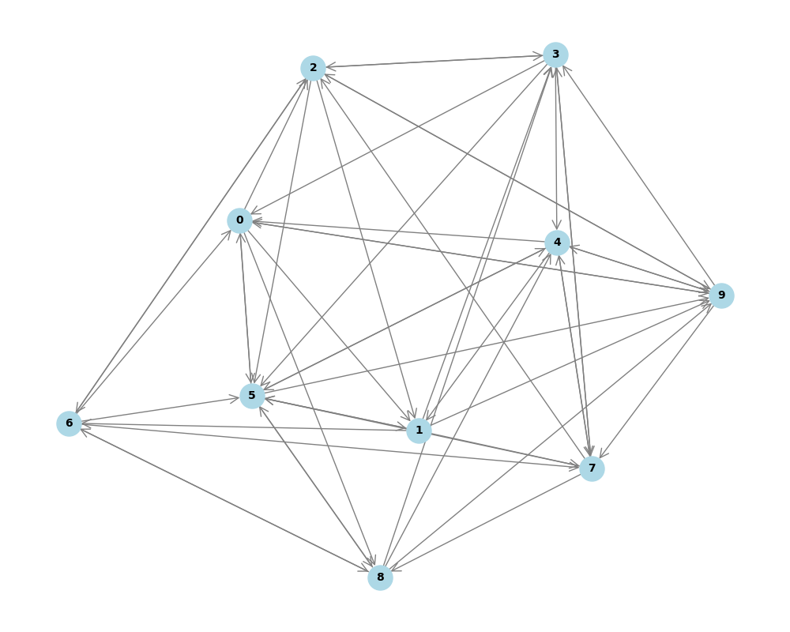
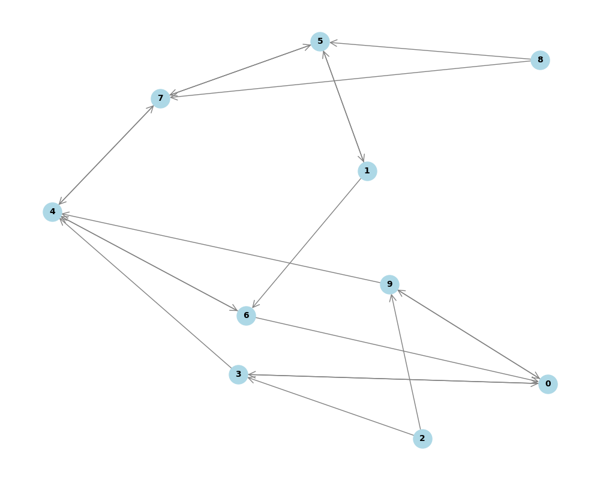

# Vamana Algorithm Implementation

This repository provides an implementation of the **Vamana Algorithm**, a proximity graph-based approach for fast and scalable nearest neighbor search in high-dimensional spaces. The Vamana algorithm is designed for fast search and large-scale graph building, and is detailed in the paper **"DiskANN: Fast Accurate Billion-point Nearest Neighbor Search on a Single Node"** by the **Microsoft Research team**, led by **Suhas Jayaram Subramanya** and team.

The Vamana algorithm is particularly efficient for approximate nearest neighbor (ANN) searches and has applications in various domains like image retrieval, recommendation systems, and large-scale search tasks.

## Paper Reference:
**Title**: DiskANN: Fast Accurate Billion-point Nearest Neighbor Search on a Single Node  
**Authors**: Suhas Jayaram Subramanya, Devvrit, Rohan Kadekodi, Ravishankar Krishnaswamy, Harsha Simhadri  
**Conference**: NeurIPS 2019  
**Month/Year**: November 2019  
**Abstract**: Current state-of-the-art approximate nearest neighbor search (ANNS) algorithms generate indices that must be stored in main memory for fast high-recall search. This makes them expensive and limits the size of the dataset. We present a new graph-based indexing and search system called DiskANN that can index, store, and search a billion point database on a single workstation with just 64GB RAM and an inexpensive solid-state drive (SSD). DiskANN achieves high-recall, low query latency, and high density, outperforming other state-of-the-art methods in both low-memory and high-recall scenarios.  
**URL**: [DiskANN Paper](https://www.microsoft.com/en-us/research/publication/diskann-fast-accurate-billion-point-nearest-neighbor-search-on-a-single-node/)

## Requirements

Before running the project, ensure that you have all the necessary dependencies installed. The required Python packages are listed in the `requirements.txt` file.

### Installing Dependencies
To install the required dependencies, run the following command in the terminal:

```bash
pip install -r requirements.txt
```

## Running the Project
### Step 1: Generate Data
The first step in this project is to generate data for the Vamana algorithm. You can configure the specifications for data generation in the file generate_data.py.

To generate the data, run:

```bash
python generate_data.py
```

This will generate the necessary dataset for running the algorithm.

### Step 2: Run the Vamana Algorithm
Once the data is generated, you can run the Vamana algorithm to build the proximity graph and perform nearest neighbor search. The main logic of the Vamana algorithm is implemented in the main.cpp file.

To compile and run the C++ file, use the following command:

```bash
g++ main.cpp
./a.out
```

Make sure you have a C++ compiler installed on your system.

### Step 3: Visualize the Results
After running the Vamana algorithm, you can visualize the graph and results using the visualize.py script. This script will generate a visual representation of the proximity graph.

To visualize the graph, run:

```bash
python visualize.py
```

This will display the graph with the nodes and edges, showing how the Vamana algorithm connected the data points in the nearest neighbor search.

## Before and After Comparison

The following figures demonstrate the comparison of the dataset points before and after the process:

### Initial State of Points


### Final State of Points


In the initial figure, the points are arranged based on the original dataset, while in the final figure, the points have been adjusted according to the applied process, showcasing the changes in their distribution.

## Project Structure

```bash
.
├── generate_data.py                               # Script for generating dataset
├── main.cpp                                       # C++ implementation entry point
├── vamana.h                                       # C++ header file with Vamana algorithm implementation
├── visualize.py                                   # Python script for visualizing the graph
├── README.md                                      # This readme file
├── requirements.txt                               # Python dependencies for visualization
├── data/                                          # Folder containing data files
│   ├── data.txt                                   # Contains the generated data points
│   ├── final_adjacency_list.txt                   # Contains the final adjacency list
│   ├── initial_adjacency_list.txt                 # Contains the initial adjacency list
└── figures/                                       # Folder containing graph visualizations
    ├── directed_final_graph_visualization.png     # Visualization of the final directed graph
    ├── directed_initial_graph_visualization.png   # Visualization of the initial directed graph
    ├── sample_final_fig.png                       # Sample final figure for 10 points
    └── sample_initial_fig.png                     # Sample initial figure for 10 points


```

## Key Features:
- Efficient ANN Search: Implements Vamana, a highly efficient ANN search algorithm.
- Proximity Graph Construction: Builds a directed proximity graph from the generated data.
- Visualization: Allows you to visualize the graph and the connections between data points.

## About the Vamana Algorithm
The Vamana algorithm is based on a proximity graph construction that allows efficient search and retrieval of nearest neighbors in high-dimensional space. It is designed for billion-point datasets and achieves a balance between high accuracy and fast query response times.

The algorithm is scalable and capable of handling large datasets, making it ideal for real-time applications such as recommendation systems and large-scale search engines.